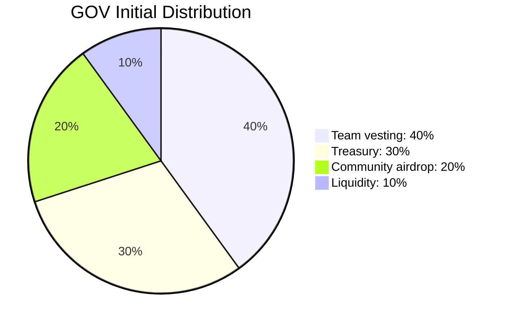

# Token Distribution

Total supply: 1,000,000 GOV

| Allocation | Amount | Destination |
| --- | ---: | --- |
| Team vesting | 400,000 GOV | `TokenVesting` |
| Treasury | 300,000 GOV | `Treasury` |
| Community airdrop | 200,000 GOV | Community wallet |
| Liquidity | 100,000 GOV | Liquidity wallet |

The team allocation is released linearly over 365 days to the team beneficiary.
