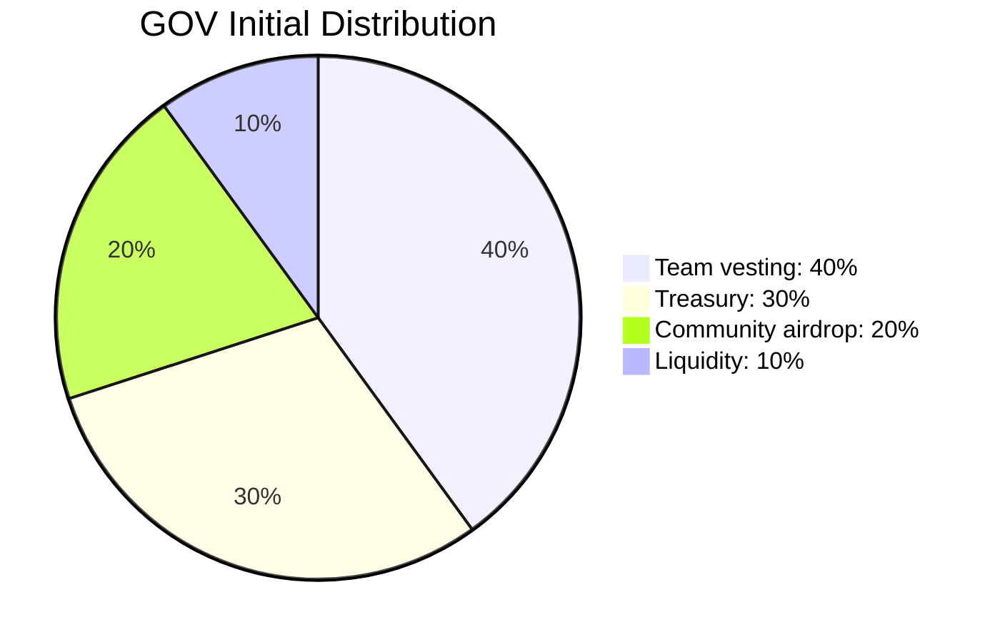

# Token Distribution

Total supply: 100,000,000 GOV

| Allocation | Amount | Destination |
| --- | ---: | --- |
| Team vesting | 40,000,000 GOV | `TokenVesting` |
| Treasury | 30,000,000 GOV | `Treasury` |
| Community airdrop | 20,000,000 GOV | Community wallet |
| Liquidity | 10,000,000 GOV | Liquidity wallet |

The team allocation is minted directly to `TokenVesting` during deployment and releases linearly to the team wallet over 365 days.
